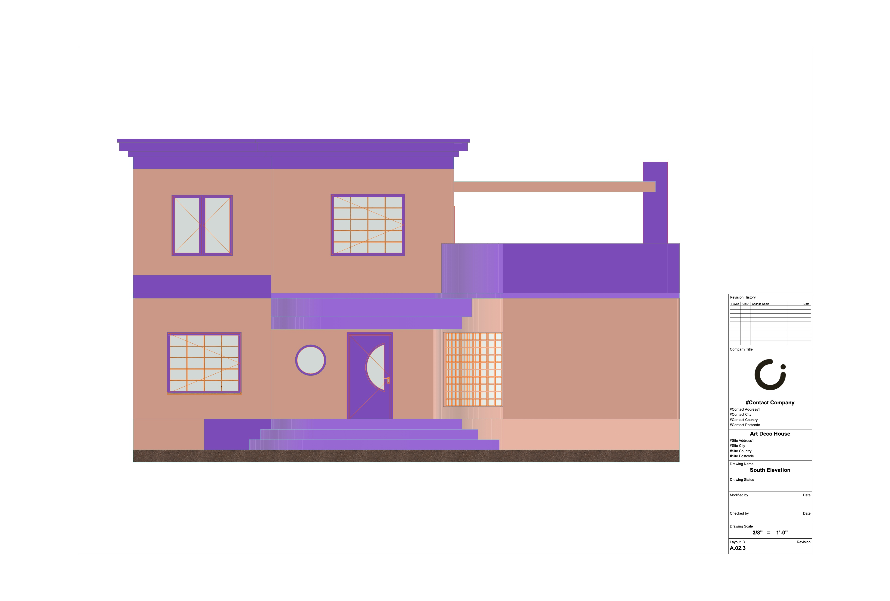
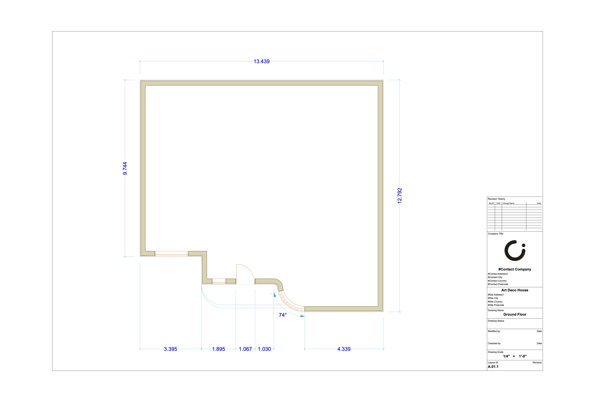
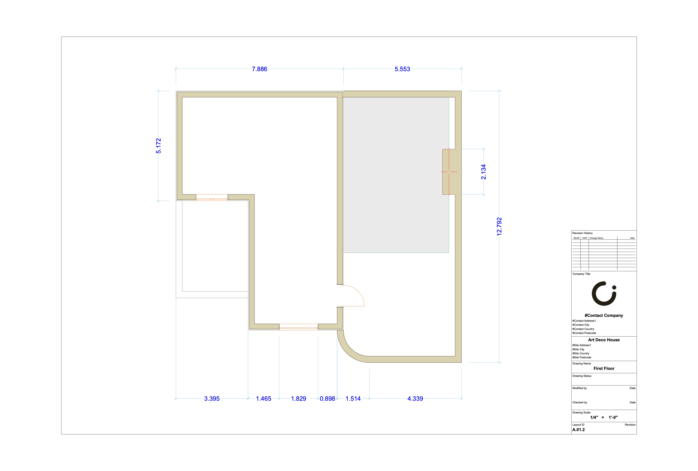
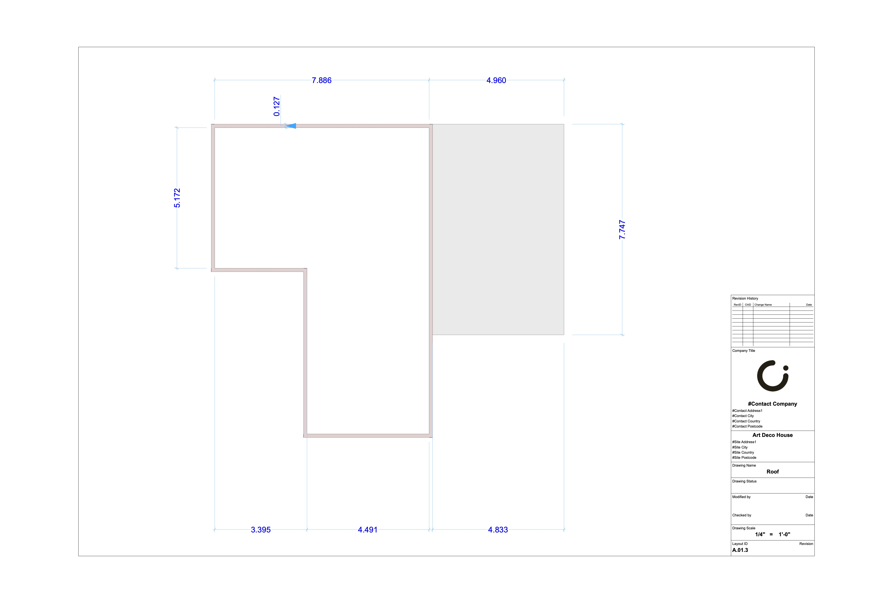

+++
title = 'Art Deco House'
date = 2024-09-13T10:42:24-07:00
draft = false
tags = ['CAD', 'past work']
+++

This layout was drawn from an image of a gorgeous Art-Deco house in Florida. I focused mainly on the exterior architecture, such as the curved facade, and therefore did not include a full floorplan in the drawings. 

<!--more-->

