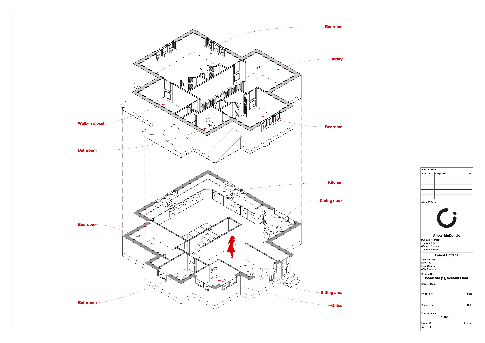

+++
title = 'Forest Cottage'
date = 2024-08-16T14:45:54-07:00
draft = false
tags = ['CAD', 'architecture', 'past work']
+++

Architectural design for a small 2-storey cottage, displayed in isometric view. 

<!--more-->

I had a lot of fun drafting this out and even more fun diagramming it! Archicad is such an amazing piece of software and I am always finding new ways to improve my work with it. This time, it was isometric views!

