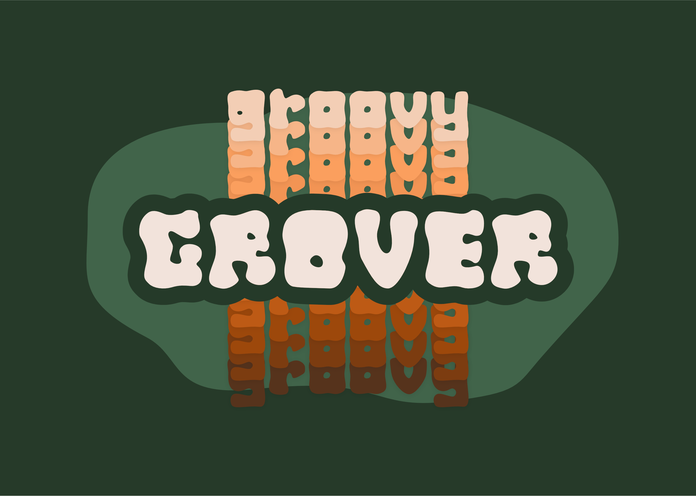
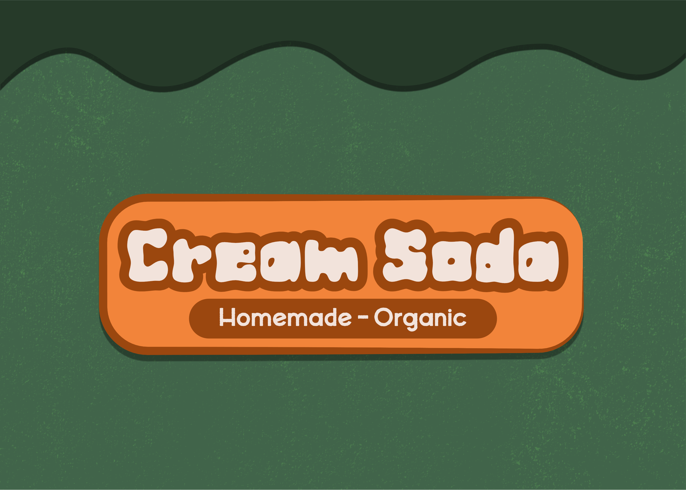
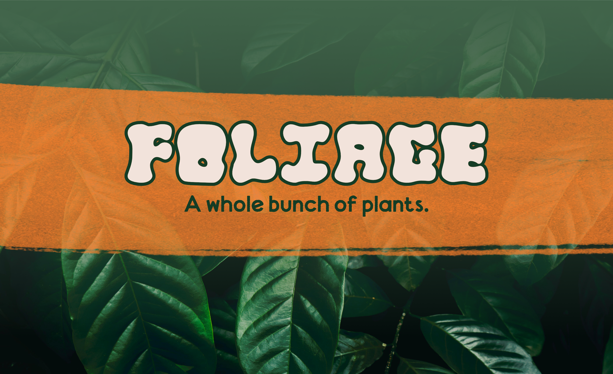
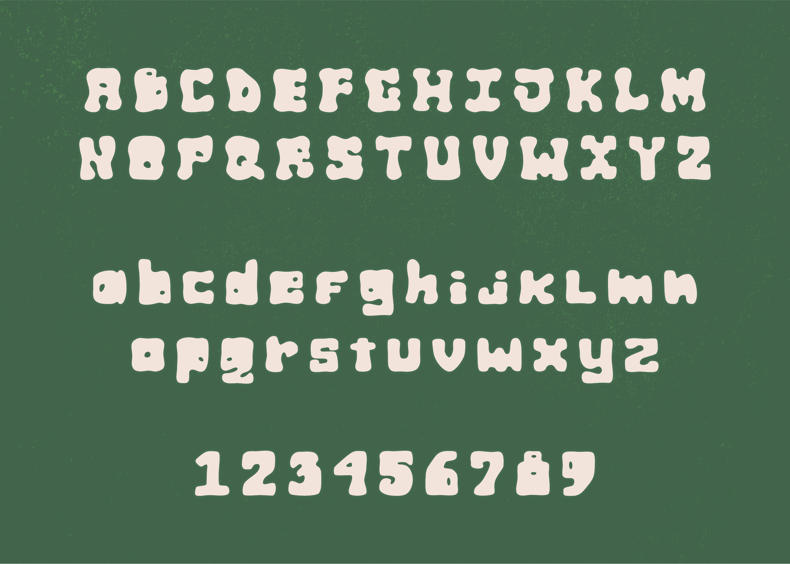

+++
title = 'Groovy Grover'
date = 2024-11-24T21:44:27-08:00
draft = true
tags = ['past work', 'fonts', 'typefaces']
+++

A wonky, wobbly, weirdo font for all your groovy needs.

# Groovy Grover

