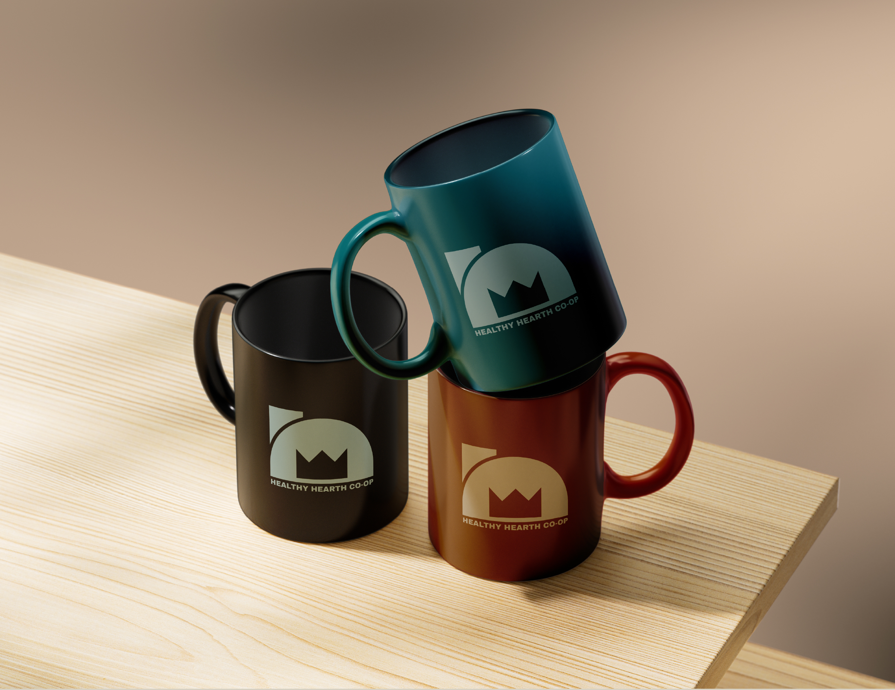
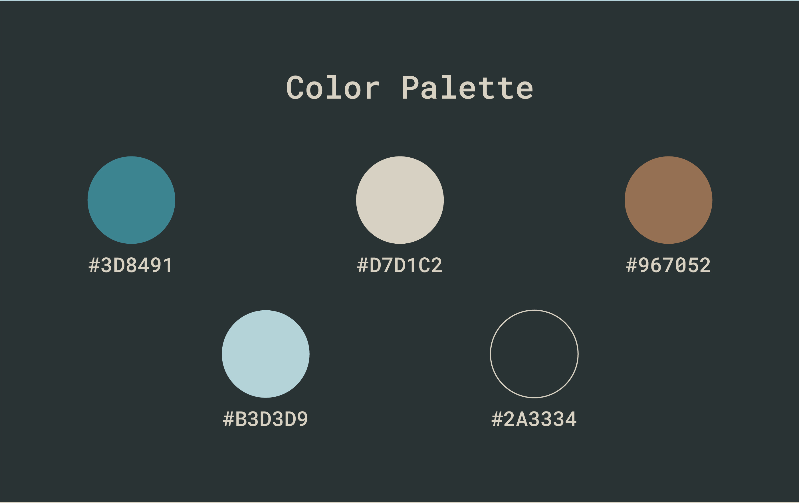

+++
title = 'Healthy Hearth'
date = 2024-07-24T20:39:35-07:00
tags = 'past work'
draft = false
+++

A full branding system for a down-to-earth coffee shop, complete with logos, colors, and a website.

<!--more-->

## The Logo
The logo represents a home, with a hearth inside of it, as well as the hearth itself with a fire inside.
The shape of the fire intentionally resembles a crown, to show the luxury that can be found in simple, rustic food and drink.

## Colors
The colors are representative of the earth, the sky, and the coffee beans used by the cafe. 

